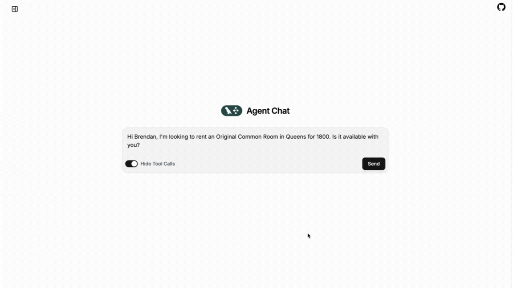
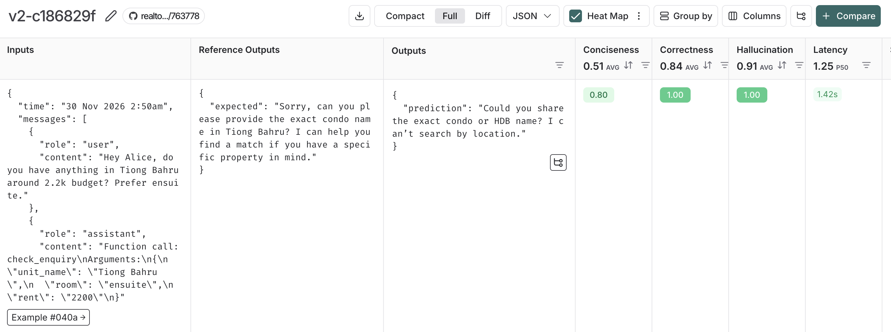
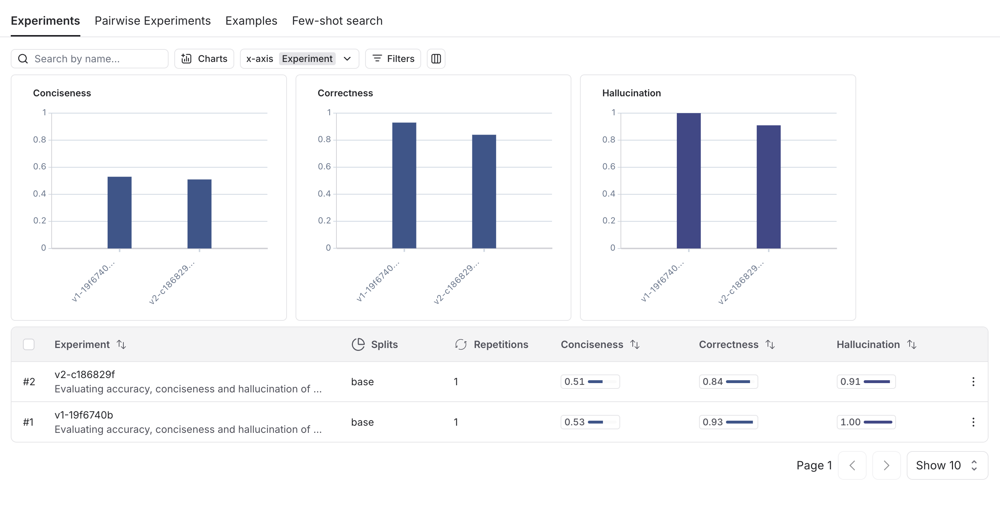
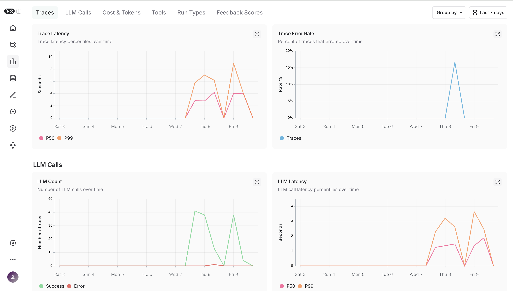
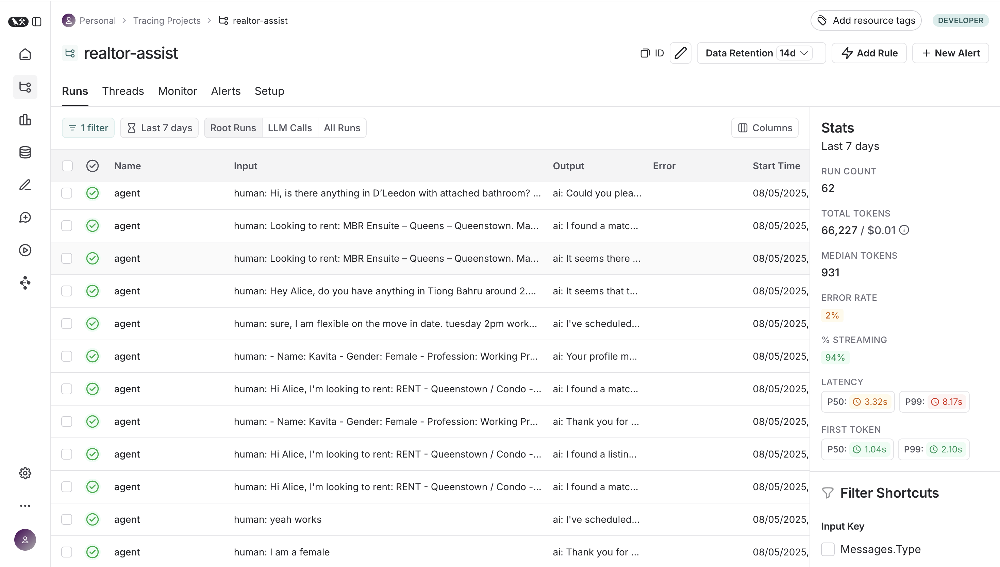

# 🏠 Propchat: Intelligent Rental Lead Assistant for Singapore Agents

**A LangGraph-powered, tool-augmented conversational AI agent designed to automate and optimize rental lead management for real estate agents in Singapore.**

Propchat integrates dynamic multi-step reasoning, Excel-based structured data, evaluation pipelines using LangSmith, and containerized deployment for real-world robustness.

---

## 📸 Demo

  
*Sample Conversation.*

---

## 🧠 System Overview

Propchat is built using LangGraph to model multi-turn agentic behavior for real estate workflows. The assistant is capable of:

- Structured tool invocation with memory and state-awareness.
- Excel-based data handling to align with local agent practices.
- Autonomous scheduling, lead qualification, and negotiation flow control.
- Observable and evaluable traces using LangSmith for continuous improvement.

It demonstrates advanced agentic patterns with introspectable flow control, model evaluation feedback loops, and a production-ready deployment interface.

---

## 🗂 Directory Structure

```
realtor-assist/
│
├── Dockerfile                     # Docker container definition
├── docker-compose.yaml            # Multi-service deployment
├── langgraph.json                 # LangGraph agent definition
├── real_estate_sheet.xlsx         # Excel source for listing data
│
├── evaluation/                    # Evaluation suite (LangSmith-driven)
│   ├── dataset.py                 # Generates evaluation dataset from traces
│   ├── helper.py                  # LangSmith API utilities
│   └── test.py                    # Prompt/model-level test runner
│
├── agent/
│   ├── agent.py                   # LangGraph conversational agent
│   ├── requirements.txt           # Python dependencies
│   └── utils/
│       ├── nodes.py               # LangGraph node definitions
│       ├── states.py              # Custom state schema
│       ├── tools.py               # Tools used by the agent
│       └── utils.py               # Misc utilities
```

---

## ⚙️ LangGraph Agent Architecture

Propchat uses LangGraph to define a state machine representing the assistant's reasoning flow.

<!--   
*Placeholder: Diagram of LangGraph state machine.* -->

---

## 🧰 Tool Layer

Custom tools are defined in `agent/utils/tools.py`, built with LangChain’s Tool interface and integrated into the graph.

### 🧩 Available Tools
- `get_agent_listings`: Read listing data from `.xlsx` file.
- `check_listing_availability`: Query availability against structured entries.
  
These tools interface directly with structured tabular data, supporting workflows familiar to Singaporean real estate agents.

---

## 📊 Evaluation with LangSmith

Propchat includes a rigorous evaluation loop using LangSmith:

- **Trace-based dataset generation**: Evaluates real-world interactions.
- **Multi-model prompt comparison**: Benchmarks performance across configurations.
- **Judged on**:
  - ✅ **Correctness**
  - ✂️ **Conciseness**
  - 🚫 **Hallucination avoidance**

Traces are automatically logged to build datasets using `evaluation/dataset.py`. Evaluations are triggered via `test.py`.

  
  

---

## 📡 Observability

Using LangSmith’s observability layer:

- Trace every interaction with token-level introspection.
- Compare different runs and prompt versions.
- Identify failure modes (tool misuse, hallucination, broken logic paths, high latency).

  


---

## 📦 Installation & Deployment

### 🔧 1. Clone the Repository

```bash
git clone https://github.com/yourname/realtor-assist.git
cd realtor-assist
```

### 🔐 2. Configure Environment Variables

Create a `.env` file in the root using `.env.example`:

### 🐳 3. Deploy with Docker Compose

```bash
docker-compose up --build
```

This launches the agent and any necessary services. Ideal for local testing, remote deployment, or staging environments.

---

## 📅 Roadmap

- ✅ Excel-based structured listing support  
- ✅ Agentic LangGraph flows with memory & tools  
- ✅ End-to-end LangSmith evaluation suite  
- ✅ Dockerized CI/CD pipeline  
- 🔜 WhatsApp integration  
- 🔜 Auto-sync with calendar availability  
- 🔜 Two-way landlord/tenant messaging module  

---

## 🎓 Technical Highlights

| Feature                        | Description |
|-------------------------------|-------------|
| 🔄 **LangGraph Agent**         | Custom state-machine-based agent with nodes, memory, and transitions. |
| 📈 **LangSmith Evaluation**    | LLM-as-judge metrics: correctness, conciseness, hallucination. |
| 🧩 **Excel Tooling**           | Agents operate directly over `.xlsx` sheets for local workflows. |
| 📦 **Docker Deployment**       | Easily containerized and deployable with Docker Compose. |
| 📡 **Full Observability**      | Trace logs, prompt diffs, and live monitoring via LangSmith. |
| 🔬 **Model Testing**           | Swap prompts/models to benchmark performance. |

---

## 🤝 Contributing

We welcome contributions in tooling, UI integrations (e.g., WhatsApp frontend), or evaluation enhancements. PRs, issues, and prompt optimizations are encouraged.

*Built with ❤️ to make every realtor’s day a little smoother.*

